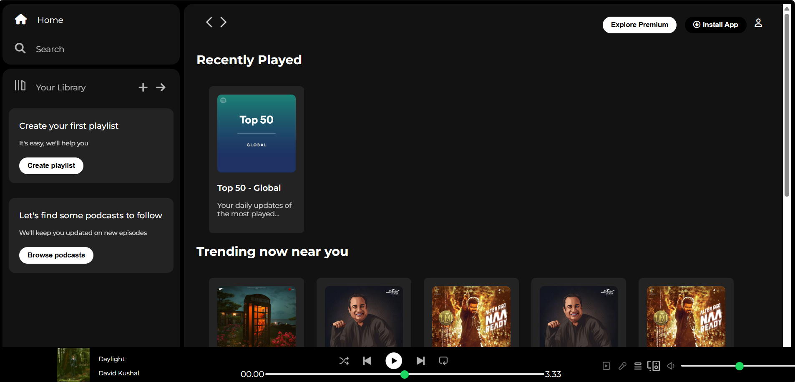

# 🎧 Spotify Clone (HTML + CSS Only)

A simple frontend-only clone of the Spotify homepage built using **HTML** and **CSS**.

## 🚀 Features

- Static layout inspired by Spotify UI
- Custom header, sidebar, and content section
- Responsive design for different screen sizes
- Pixel-perfect styling with hover effects

## 📸 Screenshots

Here’s how the clone looks:

## 🛠️ Tech Stack

- HTML5  
- CSS3 (Flexbox, Grid, Media Queries)

## 📂 Getting Started
To view or run this project locally, follow these simple steps:

1.Clone the repository:

git clone https://github.com/Priyak456/spotify-clone.git

2.Navigate to the project directory:

cd spotify-clone

3.Open the index.html file in your browser.

## 📬 Connect with Me
Feel free to connect with me!

LinkedIn: linkedin.com/in/priya482/

GitHub: github.com/Priyak456
